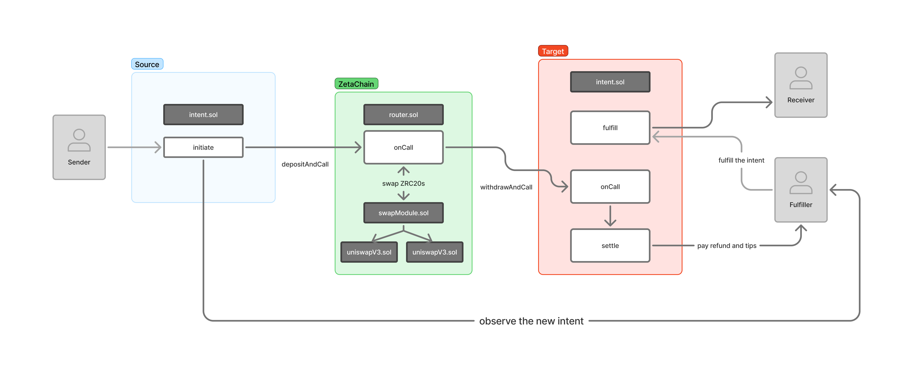

# Contract Architecture

This document provides an overview of the smart contract architecture for the intent-based bridge platform. The system consists of three main components working together to make cross-chain token transfers as fast as possible.

  

## Main Components

### Intent Contract

The Intent contract is deployed on each connected blockchain (e.g., Base, Arbitrum) and serves as:
- **Entrypoint** for users initiating cross-chain transfers
- **Endpoint** for fulfilling completed transfers on the destination chain
- **Registry** for tracking pending intents and their fulfillment status

When a user wants to transfer tokens across chains, they interact with the Intent contract on their source chain. The contract initiates a ZetaChain crosschain transaction and emits an event that is observed by fulfillers. The goal is for the recipient to immediately receive tokens from the fulfiller, while the underlying crosschain transaction completes in the background.

### Router Contract

The Router contract is the central hub deployed on ZetaChain that:
- **Coordinates** cross-chain transfers between different blockchains
- **Manages** token associations between native tokens and their ZRC20 representations
- **Handles** gas token refunds to ensure smooth operation across chains

The Router maintains a registry of supported tokens and their corresponding ZRC20 addresses on ZetaChain. It orchestrates the entire flow of a cross-chain transfer by receiving messages from source chains, processing them through the swap module, and sending results to destination chains.

### Swap Module

The Swap Module is a specialized contract deployed on ZetaChain that:
- **Abstracts** the token swapping functionality for the Router
- **Integrates** with existing decentralized exchanges (DEXs) on ZetaChain
- **Optimizes** swap routes to minimize slippage and fees

Importantly, the platform itself is **not a DEX**. Instead, it leverages existing liquidity pools and decentralized exchanges on ZetaChain to efficiently convert between different ZRC20 tokens. This design choice allows the system to focus on its core competency - facilitating fast cross-chain transfers through the intent settlement protocol - while taking advantage of the established DeFi ecosystem on ZetaChain.

## Intent-Based Architecture

The intent-based model enables fast transfers through a two-step process:
1. Users create transfer intents with specified parameters (amount, destination, etc.)
2. Specialized participants called "speedrunners" fulfill these intents for a fee

This architecture separates the actual cross-chain settlement (which can take time) from the user experience, allowing recipients to receive tokens immediately from fulfillers while the underlying cross-chain mechanics happen in the background. If no fulfiller takes the intent, the transfer will still complete through the standard ZetaChain process, but will take longer.
